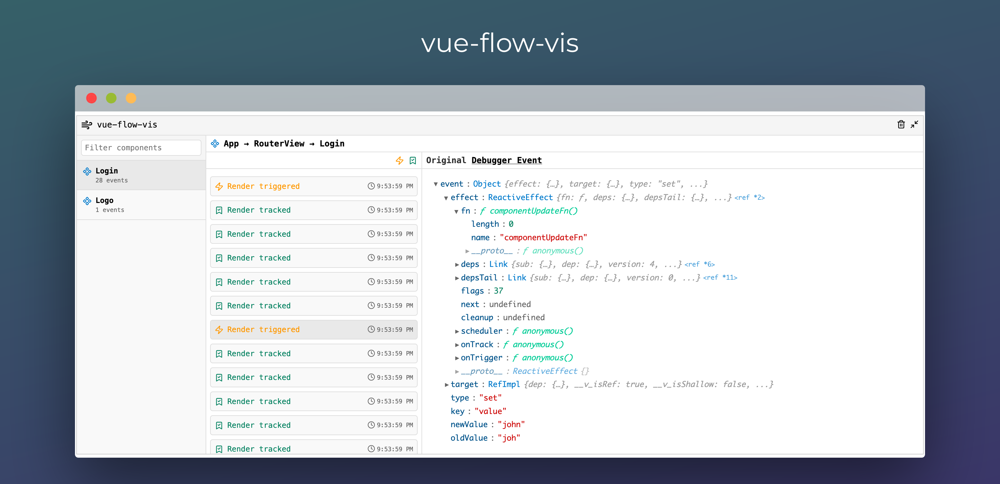

# `vue-flow-vis`

Vue 3 plugin that provides real-time monitoring of component renders using Vue's built-in debugging hooks.


## Log Example



## Installation

```bash
npm install vue-flow-vis --save-dev
# or
yarn add vue-flow-vis --dev
# or
pnpm add vue-flow-vis --dev
```

## Quick Start

```typescript
// main.ts
import { createApp } from 'vue'
import App from './App.vue'
import { FlowVisPlugin } from 'vue-flow-vis'

const app = createApp(App)

// Basic usage with default settings
app.use(FlowVisPlugin)

app.mount('#app')
```

That's it! The plugin will automatically start monitoring all your components.

More examples can be found in [examples](./examples) directory.

## Configuration Options

The plugin accepts a configuration object with the following options:

```typescript
type FlowVisOptions = {
  enabled?: boolean             // Enable/disable monitoring (default: true)
  logToTable?: boolean          // Use console.table for output (default: false)
  excludeComponents?: string[]  // Components to exclude from monitoring
  includeComponents?: string[]  // Only monitor these components (overrides exclude)
  batchLogs?: boolean           // Group console logs by component (default: true)
  batchWindow?: number          // Delay in ms before flushing batched logs (default: 500)
  onRenderTracked?: (data: RenderEventData) => void   // Custom callback for tracked events
  onRenderTriggered?: (data: RenderEventData) => void // Custom callback for triggered events
  customLogger?: Logger         // Custom logger implementation
}
```
## Bug reports & feature requests
Feel free to submit github issue here and use appropriate labels (`bug-report`/`feature-request`).

Check if a similar issue already exists before submitting.

## License

MIT License - see [LICENSE](./LICENSE) file for details